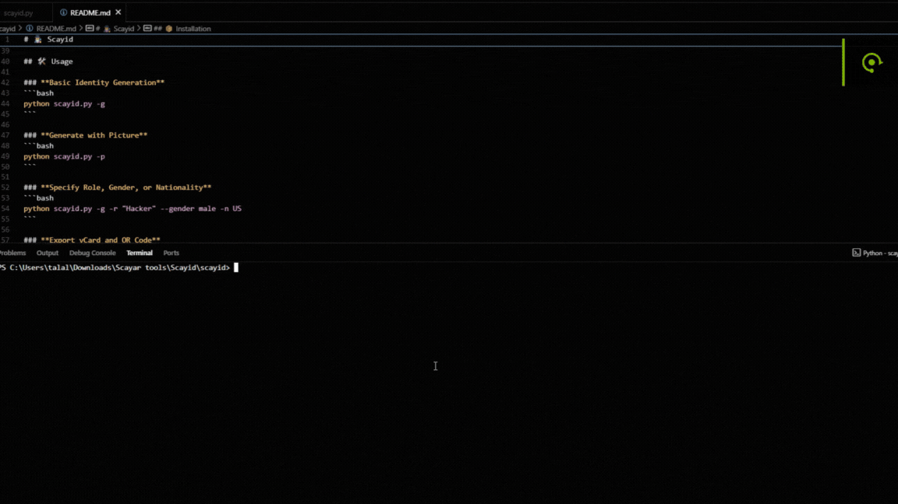

# 🕵️‍♂️ Scayid


---

> **Scayid** is a next-generation, hacker-inspired identity generator. Instantly create full fake identities, export vCards, generate QR codes, and get beautiful HTML dossiers—all with a single command.

---

## 🎬 Demo

<p align="center">
  
</p>

<p align="center"><i>Modern CLI, beautiful HTML, and instant QR/vCard export—all in one tool.</i></p>

---

## 🚀 Features

- ⚡ **Ultra-modern CLI** with rich, colored output and hacker vibes
- 🧑‍💻 **Generate full fake identities** (name, address, phone, email, job, bio, and more)
- 💳 **Auto-generates financial & security info** (credit card, SSN, PayPal, etc.)
- 📱 **Instant vCard (VCF) and QR code export** for mobile import
- 🌐 **Beautiful, mobile-friendly HTML profiles** (with QR, copy buttons, vCard download)
- 🔒 **No real data used—safe for demos, OSINT, and red teaming**

---

## 📦 Installation

```bash
# Clone the repo
$ git clone https://github.com/Scayar/scayid.git
$ cd scayid/Scayid

# Install dependencies
$ pip install -r requirements.txt
```

---

## 🛠️ Usage

### **Basic Identity Generation**
```bash
python scayid.py -g
```

### **Generate with Picture**
```bash
python scayid.py -p
```

### **Specify Role, Gender, or Nationality**
```bash
python scayid.py -g -r "Hacker" --gender male -n US
```

### **Export vCard and QR Code**
- After generation, find `.vcf` and `_qr.png` files in the profile directory.
- Scan the QR code or import the vCard on your phone!

### **Show About, Banner, or Help**
```bash
python scayid.py -a      # About
python scayid.py -b      # Banner
python scayid.py -h      # Help
```

---

## 📸 Screenshots

> 
> 

---

## ✨ Modern HTML Profile Example


---

## 🧑‍🎤 Credits & Rights

- **Author:** [Scayar](https://scayar.com)
- **Telegram:** [@im_scayar](https://t.me/im_scayar)
- **Email:** Scayar.exe@gmail.com
- **Buy Me a Coffee:** [buymeacoffee.com/scayar](https://buymeacoffee.com/scayar)
- **All rights reserved © Scayar**

---

## 🛡️ Disclaimer

Scayid is for educational, research, and red teaming purposes only. No real data is used or generated. Use responsibly.

---

## 💡 Want more features?
Open an issue or pull request—or just ask Scayar! 